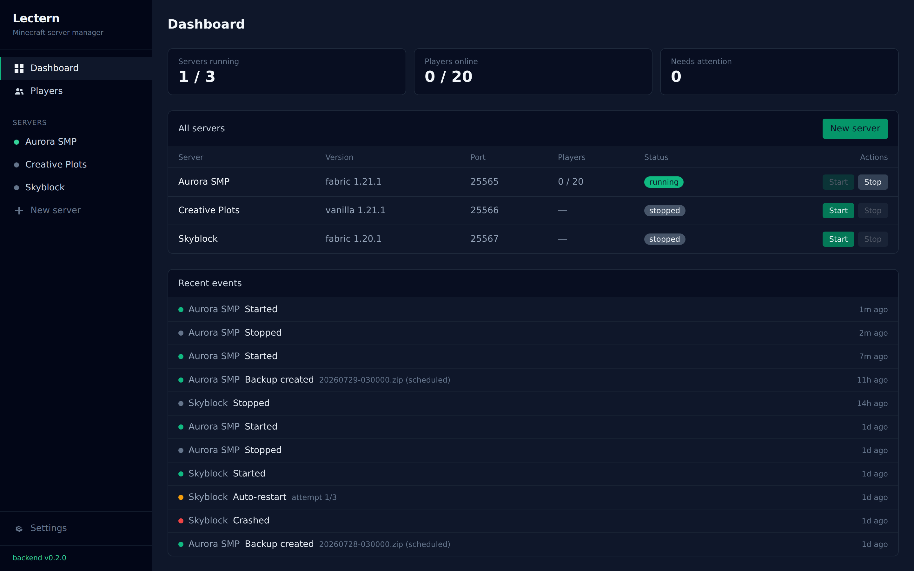
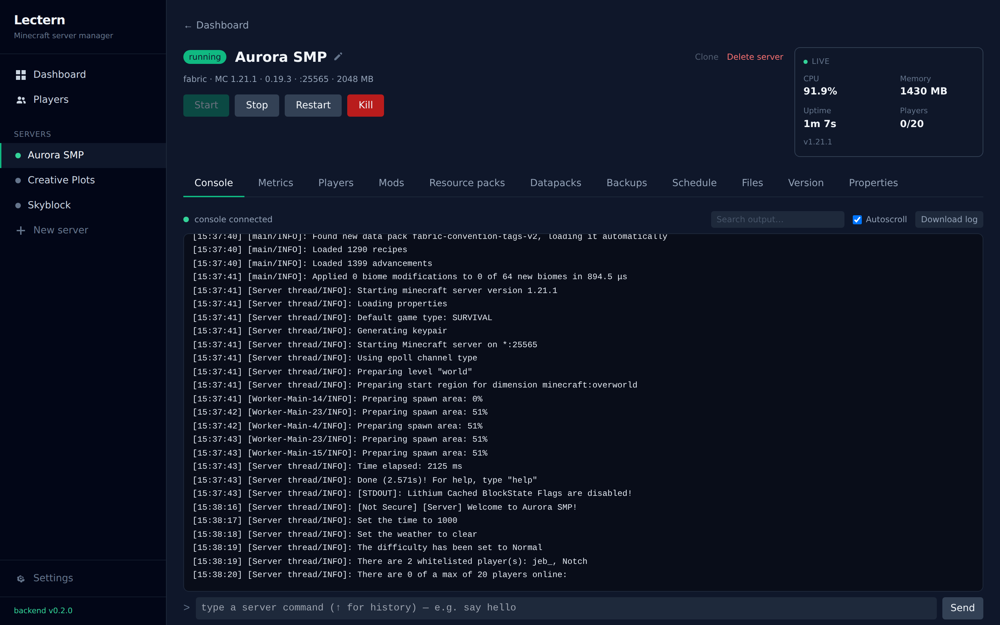
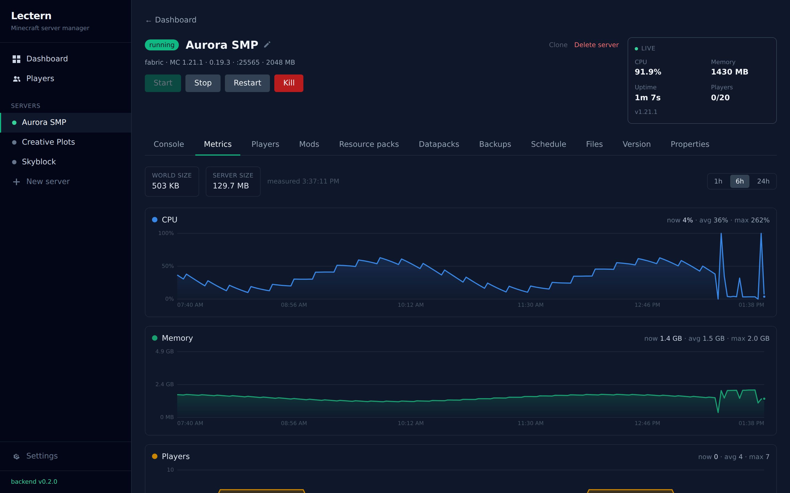
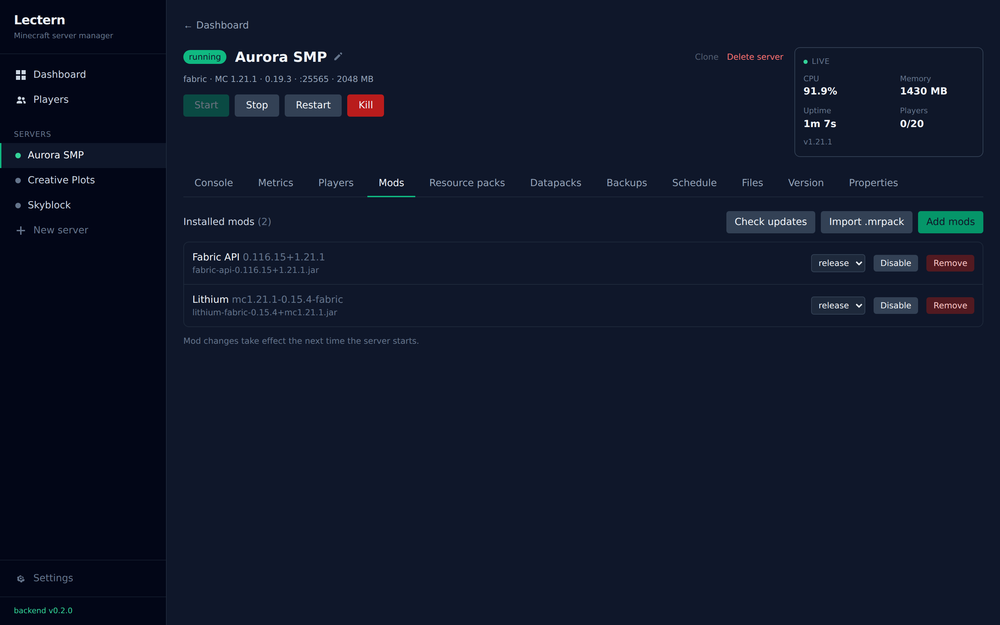
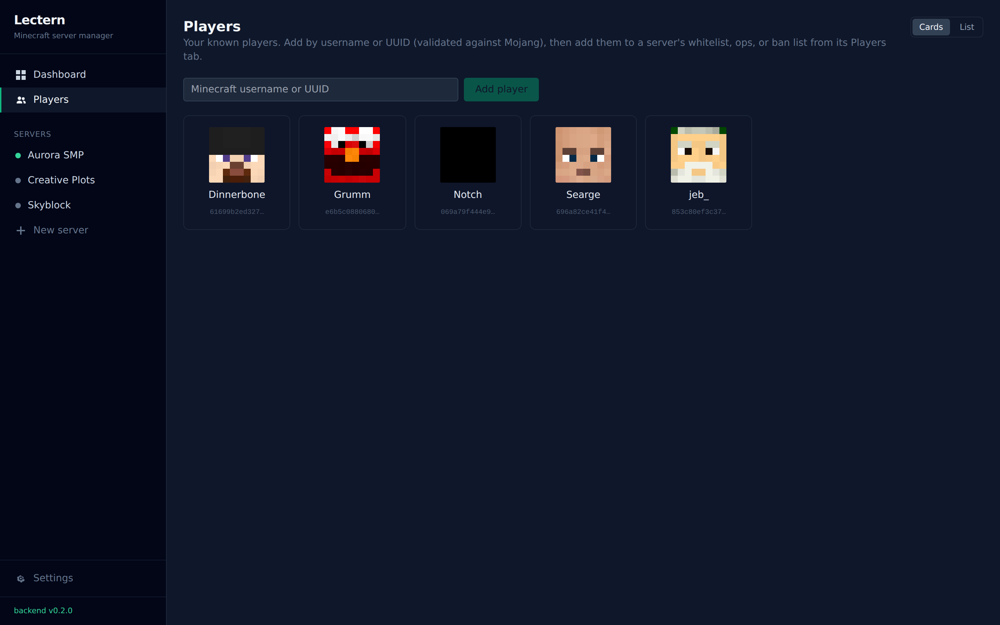

# Lectern

A self-hosted **web app for creating and managing modded Minecraft servers**. Think *Crafty's
"servers run in the background, managed over the web" model* + *Prism's mod management*, minus the
heavy auth, plus Vanilla Tweaks — designed for a trusted LAN.

Create a server from a wizard, and Lectern downloads the jar and the **exact Java runtime that
version needs**, then manages the process, console, config, content, backups and schedules from
the browser.



| Live console | Resource metrics |
|---|---|
|  |  |

| Modrinth mods | Player registry |
|---|---|
|  |  |

## Features

- **Servers** — Vanilla + **Fabric**, created from a wizard (auto jar + per-version JRE download),
  with start/stop/restart/kill, a live console (WebSocket), CPU/memory/player stats, an online
  player roster (Carpet-bot aware) with kick, and a typed `server.properties` editor. Clone a
  server, rename it, auto-start on boot (staggered).
- **Content** — browse & install **Modrinth** mods (dependency resolution, update checks),
  **Vanilla Tweaks** resource packs / datapacks / crafting tweaks, resource-pack serving,
  datapacks, and **`.mrpack` modpack import**.
- **Version change** — upgrade a server's Minecraft version: re-provisions jar + Java, migrates
  compatible mods and disables the rest, with a pre-flight compatibility check and a backup.
- **Import a world** at creation (upload a `.zip` or a URL), with mod-cache filtering.
- **Backups** — create / restore / prune / download, with per-server retention & exclusions.
- **Scheduling** — cron actions (start/stop/restart/backup/console command) via a friendly builder.
- **Event timeline** — a persisted "Recent events" feed (starts/stops, crashes & auto-restarts,
  backup and schedule outcomes) on the dashboard and per server, so overnight incidents are
  still visible in the morning.
- **File manager** — browse & edit files in a modal, upload (incl. drag-and-drop) / download,
  unzip in place, with path-confinement guards.
- **Settings** — a UI for app-level tunables (upload limits, default memory).

CurseForge, Quilt/Paper/Forge, and Bedrock are designed for as pluggable providers and come later.

## Quick start (production, one command)

Requires Docker (or Podman) with the Compose plugin.

```bash
docker compose up -d
```

Then open **http://localhost:8000** (or `http://<host-ip>:8000` on your LAN). Minecraft clients
connect on **25565**.

This pulls the pre-built image `ghcr.io/kernelcoffee/lectern` — a single container that serves the
API and the built web UI on one port. All state (database, downloaded JREs, caches, backups,
server files) lives in the `lectern_data` volume.

Images are published on two channels, selected with `LECTERN_TAG`:

| Tag | Tracks |
|---|---|
| `latest` / `stable` | The newest tagged release (default). |
| `master` | Every push to the `main` branch that passes CI — bleeding edge. |
| `1.2.3` / `1.2` | An exact release / its patch line. |

```bash
LECTERN_TAG=1.2.3 docker compose up -d          # pin a version
LECTERN_TAG=master docker compose up -d         # ride the main branch
docker compose pull && docker compose up -d     # upgrade in place
```

> **Multiple servers / custom ports:** the compose file publishes a single `25565`. To run
> several servers at once, or use custom per-server ports, publish a range instead — e.g.
> `"25565-25575:25565-25575"` in `docker-compose.yml`.
>
> **Build from source instead of pulling:** run `docker build -t lectern .` against the
> `Dockerfile`, or use the hot-reload stack in `docker-compose.dev.yml` (see Development below).

## Configuration

Everything is optional. Deployment settings are environment variables; the operational tunables
below them are also editable at runtime from the in-app **Settings** page (stored in the database).

| Variable | Default | Purpose |
|---|---|---|
| `LECTERN_DATA` | `/data` (image) | Directory for the DB, JREs, caches, backups, and server files. |
| `LECTERN_HOST` | `0.0.0.0` | API/web bind address. |
| `LECTERN_PORT` | `8000` | API/web port. |

Lectern is built for a **trusted LAN** — there is no user auth. Don't expose it directly to the
internet; put it behind a VPN or a reverse proxy with access control if you need remote access.

## Development

### With Docker/Podman (hot-reload)

```bash
docker compose -f docker-compose.dev.yml up
```

- Backend: http://localhost:8000 (health at `/api/health`)
- Frontend (Vite, proxies `/api`): http://localhost:5173

### Locally, without containers

Backend:

```bash
cd backend
python -m venv .venv && source .venv/bin/activate
pip install -e ".[dev]"
LECTERN_DATA=./data uvicorn lectern.main:app --reload
python -m pytest -q            # tests
```

Frontend:

```bash
cd frontend
npm install
npm run dev                    # http://localhost:5173
npm run build                  # type-check + production build
```

## Documentation

- [`docs/functional.md`](docs/functional.md) — what Lectern does (functional spec).
- [`docs/technical.md`](docs/technical.md) — architecture + external service integration.

## Tech stack

- **Backend:** Python + FastAPI (async, WebSockets), SQLModel/SQLite, APScheduler, httpx.
- **Frontend:** React + TypeScript (Vite), Tailwind.
